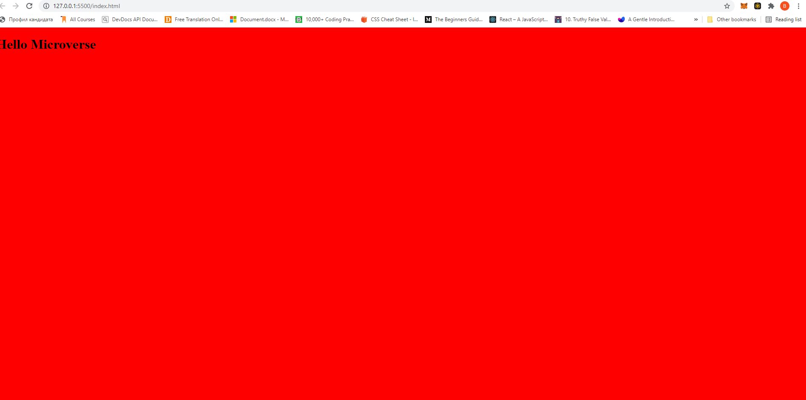

# Project Name
Hello Microverse
>Simple html file that contain a headline
 # PR description:

red Background with Microverse suggested title

## Built With

- HTML
- CSS
- Linter

## Getting Started

**This is an example of how you may give instructions on setting up your project locally.**
**Modify this file to match your project, remove sections that don't apply. For example: delete the testing section if the currect project doesn't require testing.**

To get a local copy up and running follow these simple example steps.

### Prerequisites

Chrome or any explorer

## Authors

👤 **Bogdan Stojanovic**

- GitHub:https://github.com/kakarrot92
- Twitter:https://twitter.com/kakarrot1992
- LinkedIn:https://www.linkedin.com/in/bogdan-stojanovic-97829b136/

